# 🛡️ IT Support Enterprise Lab Portfolio
**Administrator:** John Belita
**Location:** Calgary, AB
**Environment:** Windows Server 2022, Windows 11, Action1 RMM, Jira Service Management

---

## 🏗️ Section 0: Infrastructure Implementation
*Building the foundational server environment and promoting the Domain Controller.*

### 0.1 Virtual Machine Configuration
> *Provisioned a Windows Server 2022 VM with optimized resource allocation (2 vCPU, 8GB RAM) and installed Guest Additions for improved host-to-guest integration.*

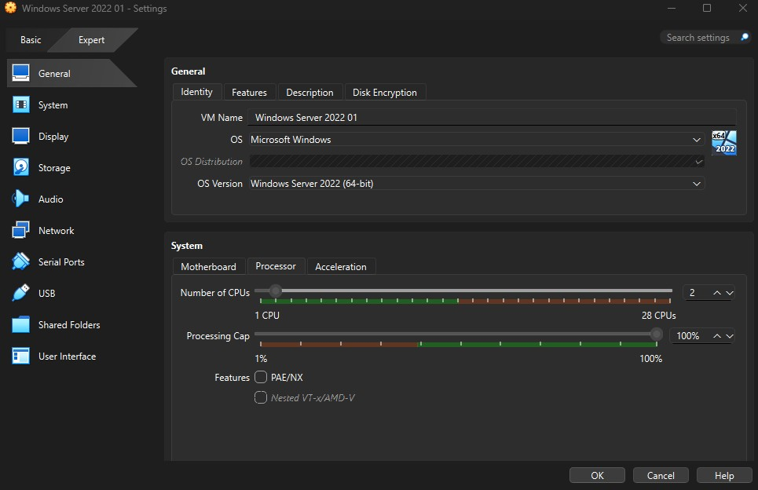

### 0.2 Network Configuration & Shared Storage
> *Configured a static IP (10.0.0.10) for the server and established a secure Shared Folder path to simulate a mapped network drive for file transfer.*

### 0.3 Domain Controller Promotion
> *Promoted the server to a Domain Controller (YYC-DC-01) by installing AD DS roles and creating a new forest root domain (belita.com).*

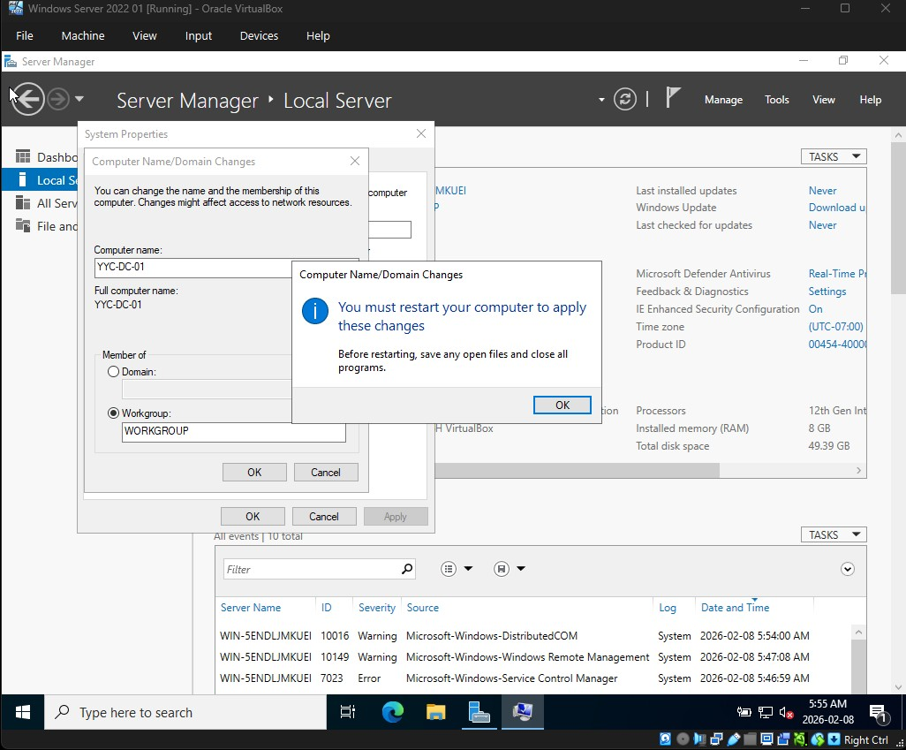

### 0.4 Verification
> *Verified successful deployment of Active Directory Users and Computers (ADUC).*

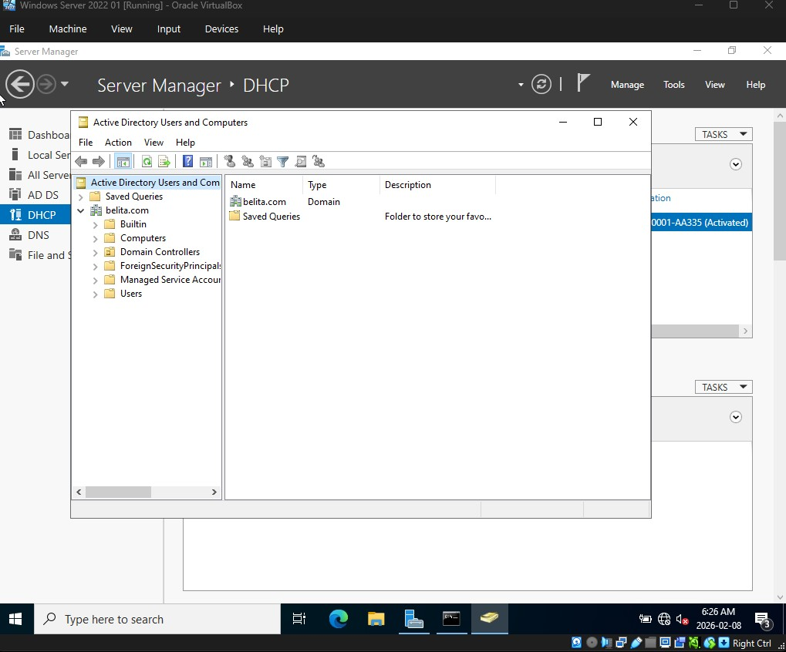

---

## 💻 Section 1: Client Workstation Deployment
*Configuring and joining a Windows 11 endpoint to the corporate domain.*

### 1.1 OS Installation & Selection
> *Selected Windows 11 Pro to ensure domain-joining capabilities, as Windows 11 Home does not support Active Directory integration.*

### 1.2 DNS Configuration
> *Configured the Windows 11 Client DNS settings to point directly to the Domain Controller (10.0.0.10), ensuring successful name resolution for the belita.com domain.*

### 1.3 Domain Join
> *Successfully joined the Windows 11 client to the 'belita.com' Active Directory domain using administrative credentials.*

---

## 📂 Section 2: Identity & Access Management (Active Directory)
*Demonstrating core competency in user lifecycle management, security groups, and organizational structure.*

### 2.1 Organizational Unit (OU) Design
> *Designed a hierarchical OU structure to separate 'Admin' accounts from 'Standard Users' and 'Service Accounts,' ensuring granular policy application.*

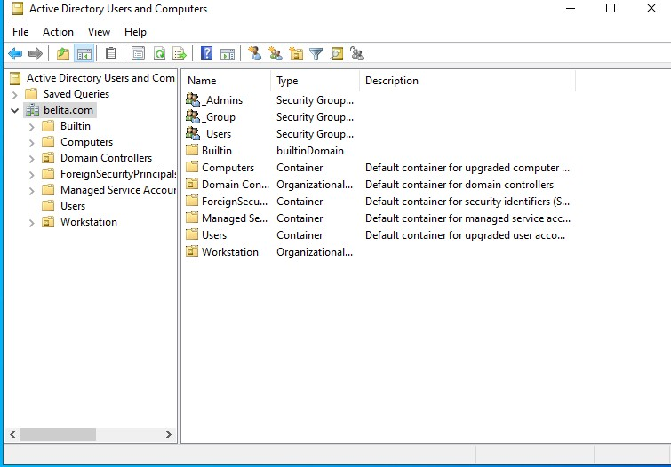

### 2.2 Advanced User Provisioning
> *Provisioned new user accounts (e.g., Neil Nepu) with standard naming conventions and configured strict Logon Hours/Account Expiry to enhance security.*

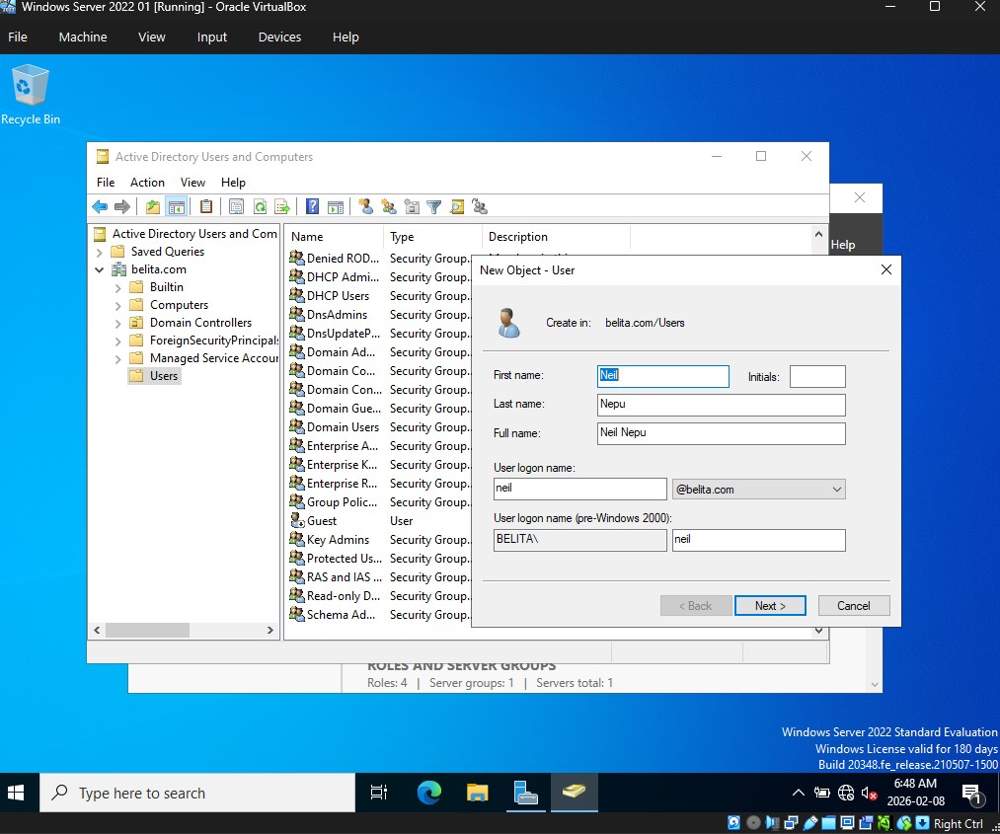
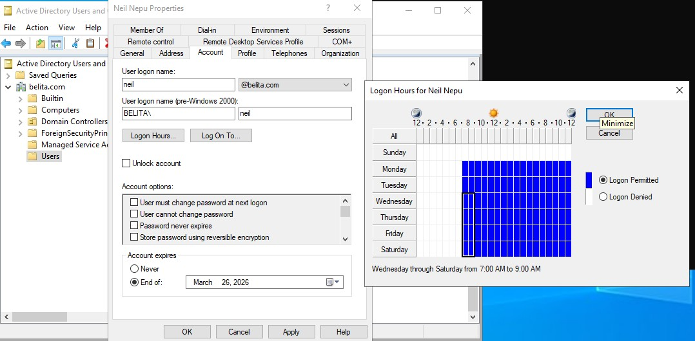

### 2.3 End-to-End Verification
> *Verified end-to-end connectivity by logging into the client workstation using the provisioned Active Directory user account.*

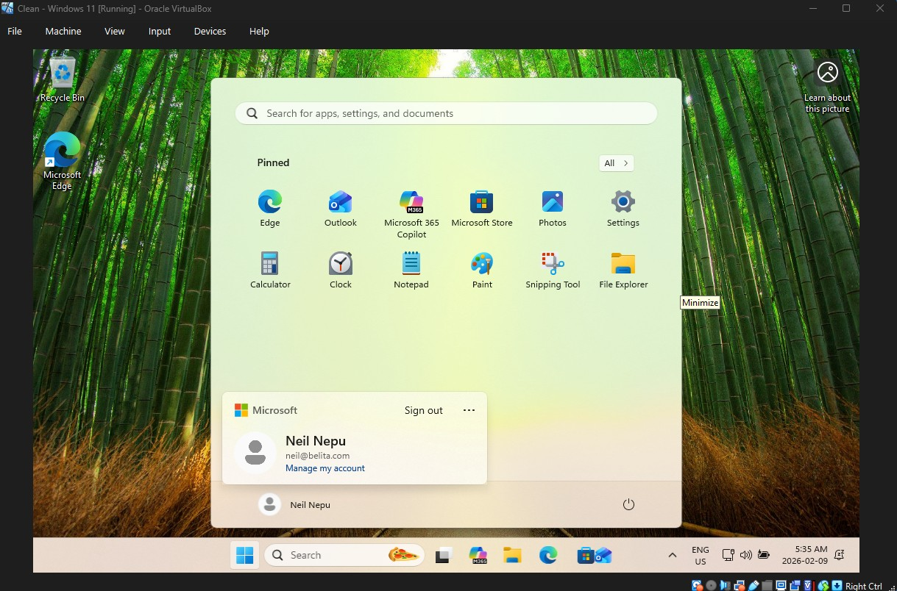

---

## 🗄️ Section 3: File Server & Storage Management
*Implementing Role-Based Access Control (RBAC) and secure file sharing.*

### 3.1 File Share Hierarchy
> *Designed a structured file share hierarchy (HR, IT, Data) to segregate sensitive departmental data from public common areas.*

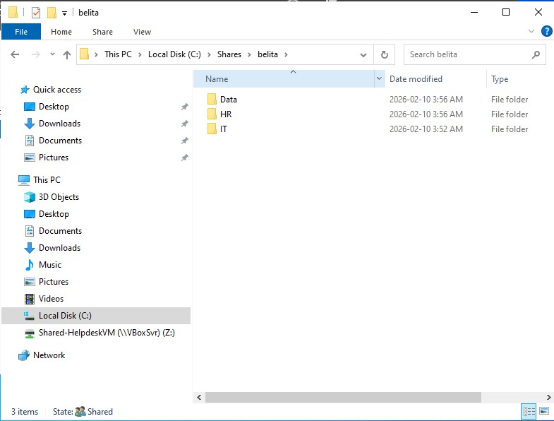

### 3.2 NTFS Permissions & RBAC
> *Configured strict NTFS permissions using Security Groups (e.g., 'IT_Access') rather than individual users, ensuring scalable access management.*

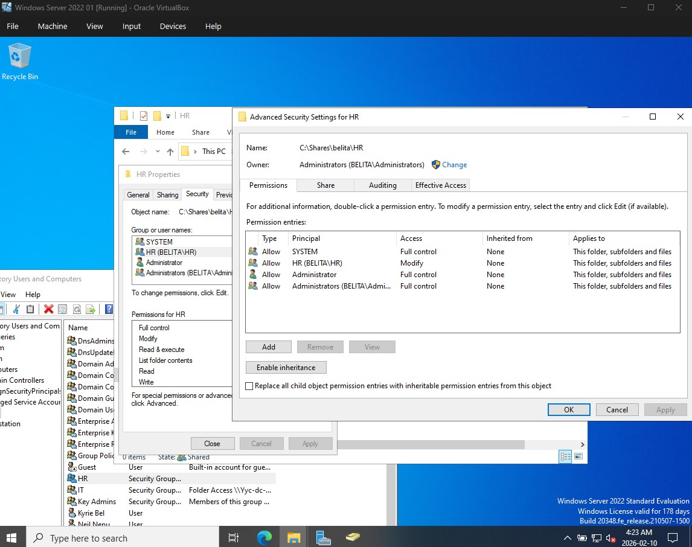

### 3.3 Permission Validation
> *Validated permission inheritance by confirming 'Access Denied' restrictions when unauthorized users attempted to access restricted folders.*

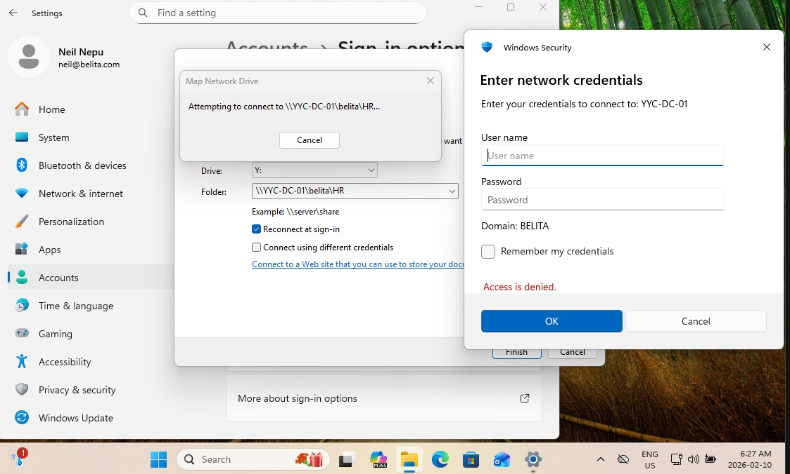

---

## ⚙️ Section 4: Group Policy & Security Hardening
*Showcasing the ability to automate configuration and enforce security protocols.*

### 4.1 Password & Lockout Policies
> *Enforced a strict Password Policy (12-char min, 90-day rotation) and Account Lockout Policy (3 attempts) to mitigate brute-force attacks.*

### 4.2 Security Validation (Simulated Attack)
> *Simulated a brute-force attempt and verified that the account was successfully locked out, preventing unauthorized access. Also verified Logon Hour restrictions.*

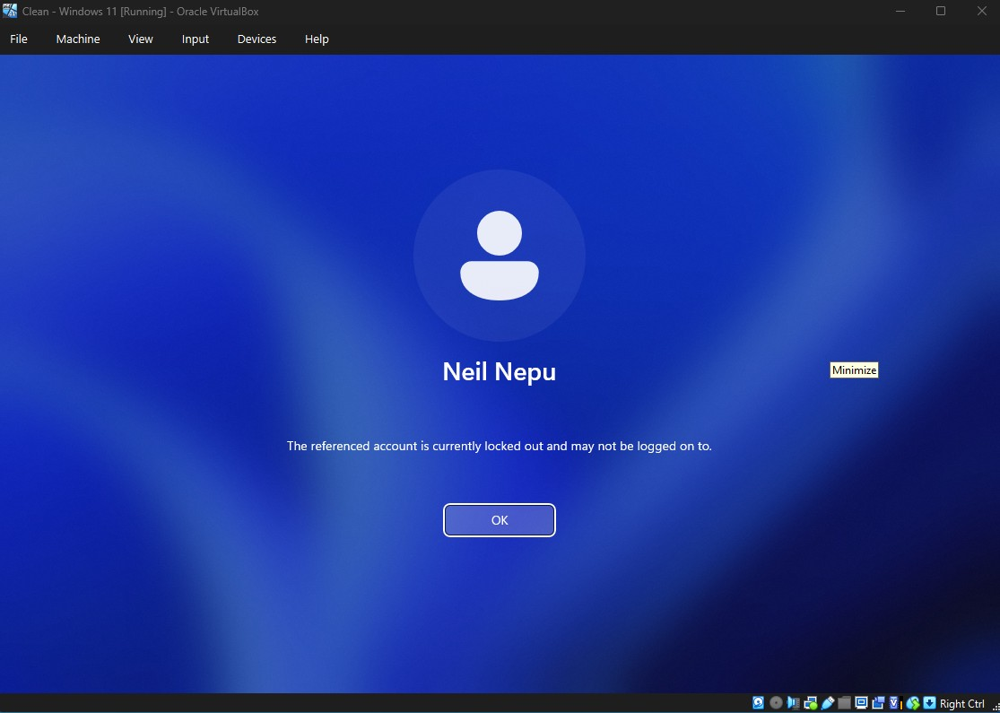

---

## ☁️ Section 5: Cloud RMM & Patch Management (Action1)
*Demonstrating modern, cloud-based fleet management and vulnerability remediation.*

### 5.1 Hybrid Integration (Active Directory Connector)
> *Configured the Action1 AD Connector to automatically discover and sync on-premise assets with the cloud platform, ensuring real-time fleet visibility.*

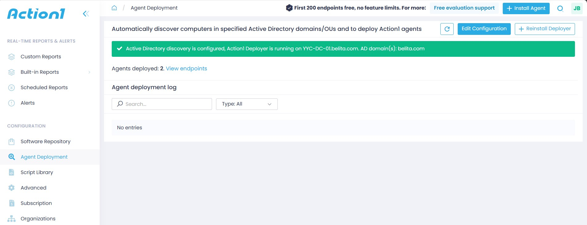
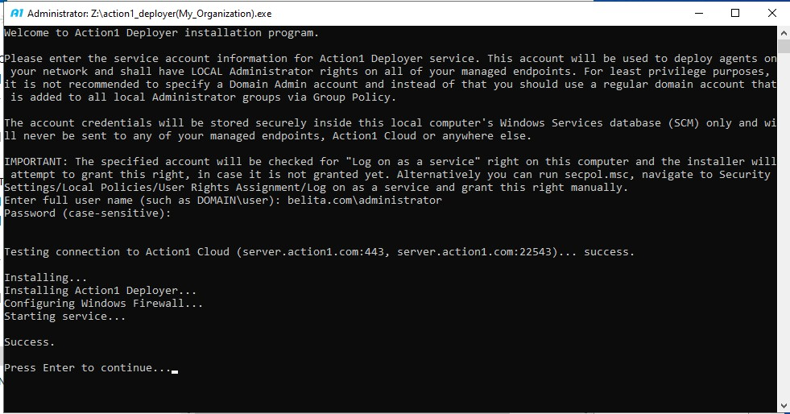

### 5.2 Vulnerability Management & Patching
> *Performed automated vulnerability assessments to identify critical CVEs and executed patch remediation workflows to secure the environment.*

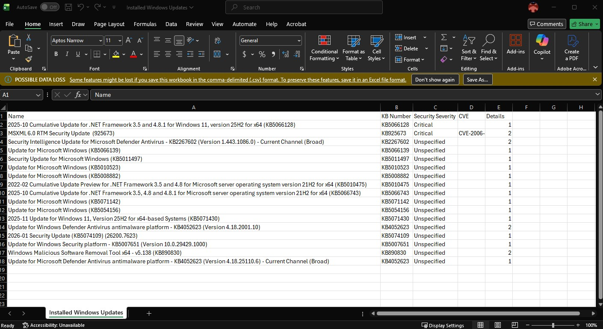

### 5.3 Automated Software Deployment
> *Leveraged the Action1 App Store to deploy certified third-party applications (7-Zip) to client endpoints without manual intervention.*

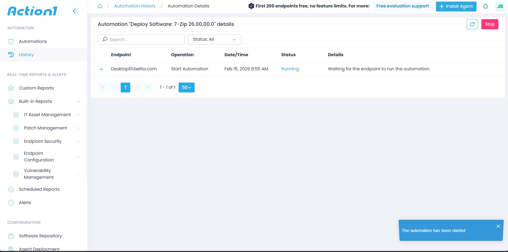

---

## 📡 Section 6: Remote Administration
*Utilizing built-in Windows tools for remote troubleshooting and management.*

### 6.1 Administrative Shares (C$)
> *Utilized administrative shares (C$) to remotely access and troubleshoot client file systems without interrupting the user's active session.*

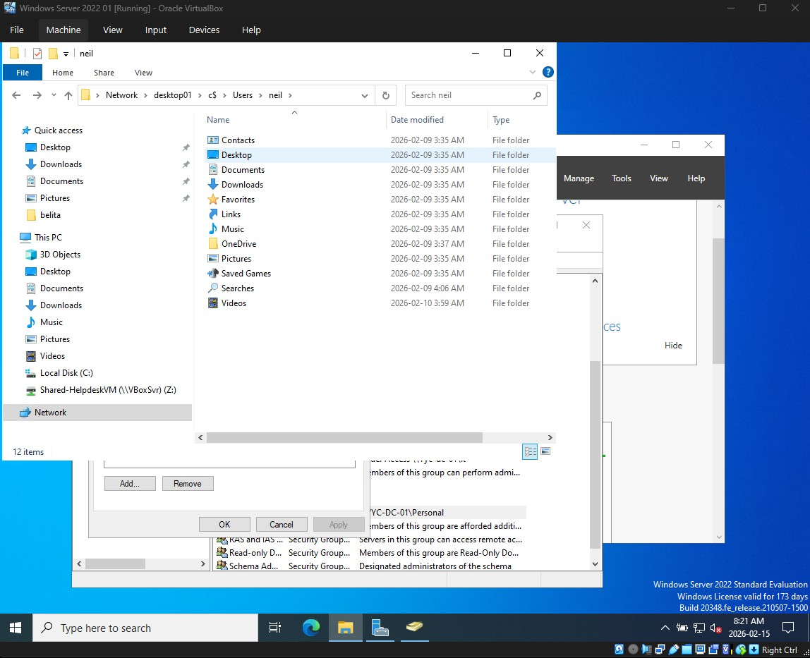

---

## 🎫 Section 7: IT Service Management (Jira Service Management)
*Proving the ability to manage the ticket lifecycle, SLAs, and user communication.*

### 7.1 Identity Synchronization
> *Synced on-premise Active Directory users to Jira Service Management, ensuring seamless authentication and customer profile management.*

### 7.2 Ticket Triage & Queue Management
> *Managed the IT Service Desk queue, prioritizing high-impact incidents and using Internal Notes to track investigation steps.*

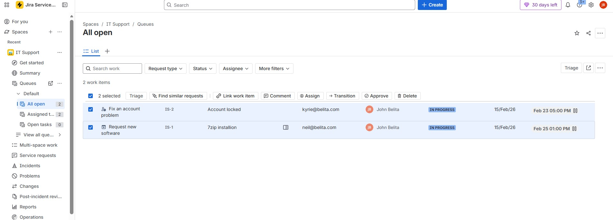
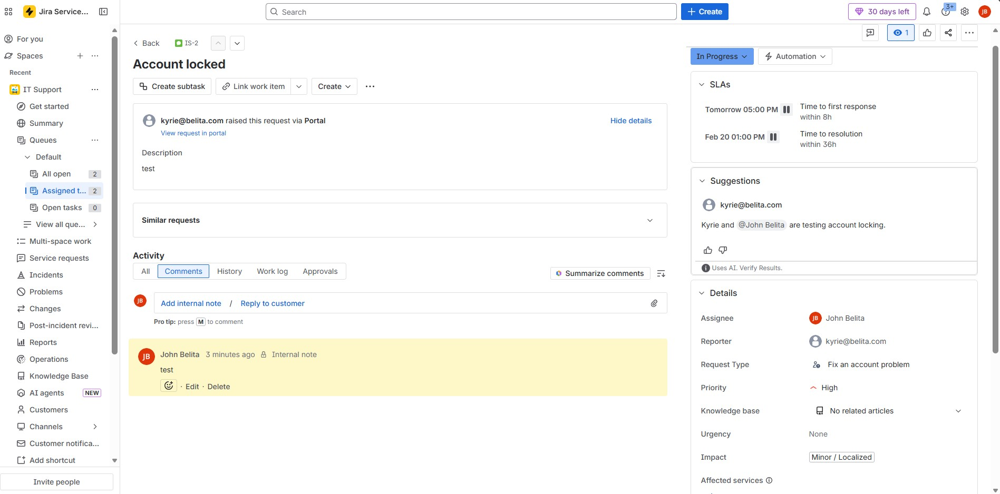

### 7.3 Service Level Agreements (SLA)
> *Adhered to strict SLA windows for "Time to First Response" and "Time to Resolution," as demonstrated by the live SLA timer in high-priority tickets.*

### 7.4 Service Request Fulfillment
> *Configured a self-service Customer Portal for software requests and fulfilled them using automated RMM workflows.*

### 7.5 Incident Management (Break/Fix)
> *Resolved a high-priority 'User Locked Out' incident by verifying identity, unlocking the account in AD, and documenting the resolution.*

---

## 📫 Contact
**John Belita** | Calgary, AB
