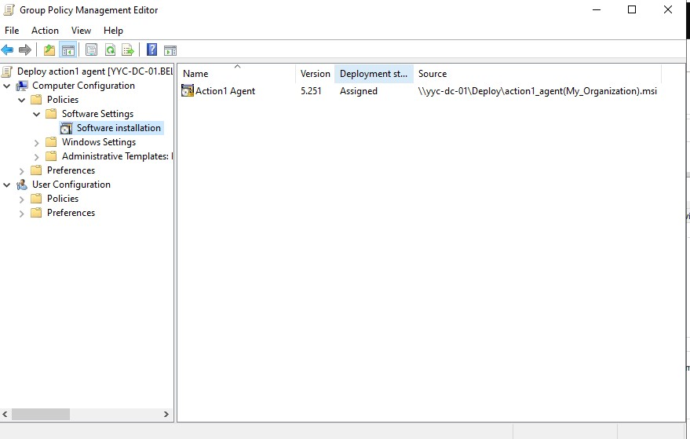
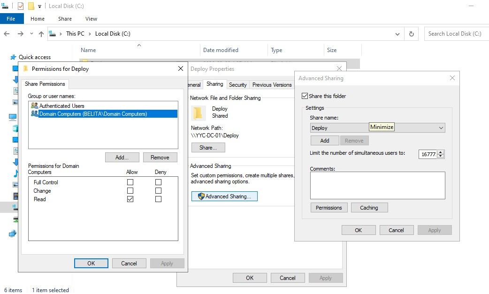
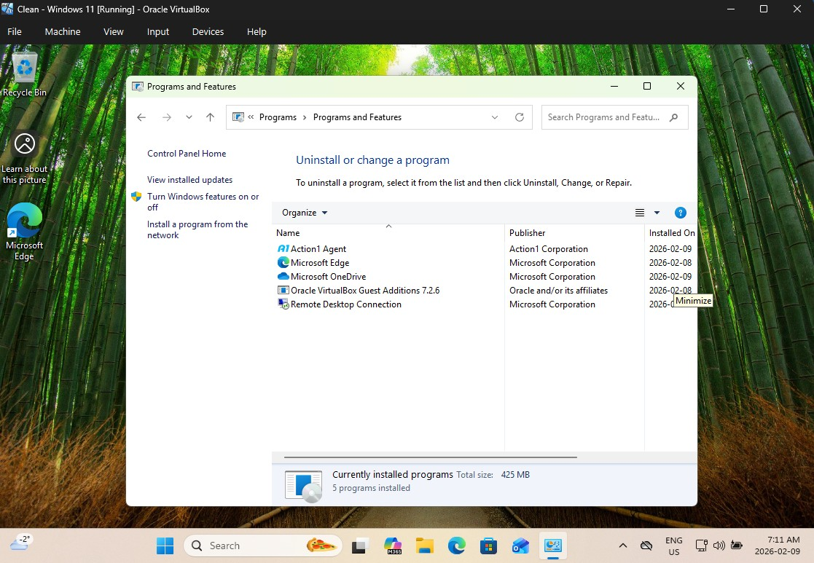
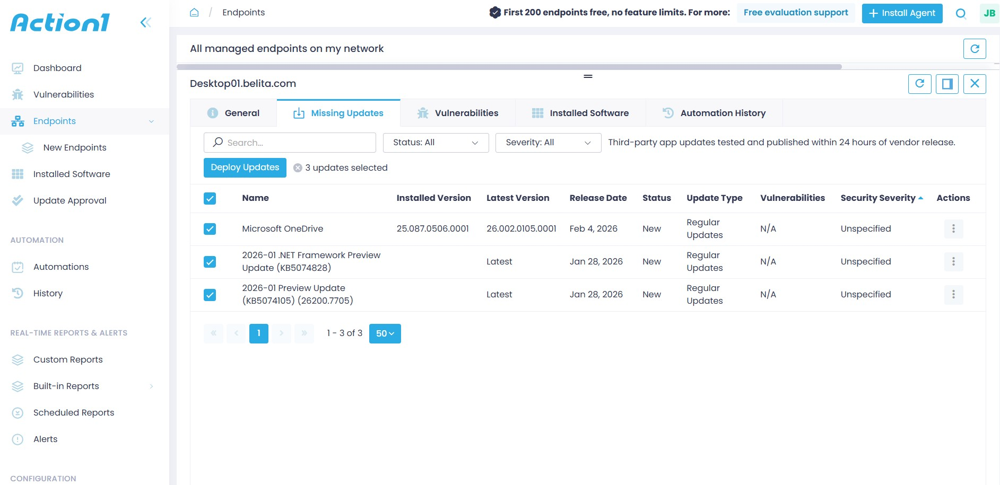

# 🛡️ IT Support Enterprise Lab Portfolio
**Administrator:** John Belita
**Location:** Calgary, AB
**Environment:** Windows Server 2022, Windows 11, Action1 RMM, Jira Service Management

---

## 🏗️ Section 0: Infrastructure Implementation
*Building the foundational server environment and promoting the Domain Controller.*

### 0.1 Virtual Machine Configuration
> *Provisioned a Windows Server 2022 VM with optimized resource allocation (2 vCPU, 8GB RAM) and installed Guest Additions for improved host-to-guest integration.*

### 0.2 Network Configuration & Shared Storage
> *Configured a static IP (10.0.0.10) for the server and established a secure Shared Folder path to simulate a mapped network drive for file transfer.*

### 0.3 Domain Controller Promotion
> *Promoted the server to a Domain Controller (YYC-DC-01) by installing AD DS roles and creating a new forest root domain (belita.com).*

### 0.4 Verification
> *Verified successful deployment of Active Directory Users and Computers (ADUC).*

---

## 💻 Section 1: Client Workstation Deployment
*Configuring and joining a Windows 11 endpoint to the corporate domain.*

### 1.1 OS Installation & Selection
> *Selected Windows 11 Pro to ensure domain-joining capabilities, as Windows 11 Home does not support Active Directory integration.*

### 1.2 DNS Configuration
> *Configured the Windows 11 Client DNS settings to point directly to the Domain Controller (10.0.0.10), ensuring successful name resolution for the belita.com domain.*

### 1.3 Domain Join
> *Successfully joined the Windows 11 client to the 'belita.com' Active Directory domain using administrative credentials.*

---

## 📂 Section 2: Identity & Access Management (Active Directory)
*Demonstrating core competency in user lifecycle management, security groups, and organizational structure.*

### 2.1 Organizational Unit (OU) Design
> *Designed a hierarchical OU structure to separate 'Admin' accounts from 'Standard Users' and 'Service Accounts,' ensuring granular policy application.*

### 2.2 Advanced User Provisioning
> *Provisioned new user accounts (e.g., Neil Nepu) with standard naming conventions and configured strict Logon Hours/Account Expiry to enhance security.*

### 2.3 End-to-End Verification
> *Verified end-to-end connectivity by logging into the client workstation using the provisioned Active Directory user account.*

---

## ⚙️ Section 3: Group Policy & Security Hardening
*Showcasing the ability to automate configuration and enforce security protocols.*

### 3.1 Password & Lockout Policies
> *Enforced a strict Password Policy (12-char min, 90-day rotation) and Account Lockout Policy (3 attempts) to mitigate brute-force attacks.*

### 3.2 Security Validation (Simulated Attack)
> *Simulated a brute-force attempt and verified that the account was successfully locked out, preventing unauthorized access. Also verified Logon Hour restrictions.*

### 3.3 Drive Mapping Automation
> *Configured Group Policy Preferences (GPP) to automatically map network drives (Z:) based on user Security Group membership.*

---

## ☁️ Section 4: Cloud RMM & Patch Management (Action1)
*Demonstrating modern, cloud-based fleet management and vulnerability remediation.*

### 4.1 Automated Agent Deployment
> *Configured a GPO to automatically deploy the Action1 RMM agent to all domain-joined computers via a centralized network share.*

### 4.2 Endpoint Verification
> *Verified successful agent installation on the client and confirmed connectivity in the Action1 Cloud Dashboard.*

### 4.3 Vulnerability Management & Reporting
> *Performed vulnerability assessments to identify missing patches and generated executive compliance reports for audit purposes.*

---

## 🎫 Section 5: IT Service Management (Jira Service Management)
*Proving the ability to manage the ticket lifecycle, SLAs, and user communication.*

### 5.1 Service Request Fulfillment
> *Triaged and resolved a software installation request, deploying the application via RMM.*

### 5.2 Incident Management (Break/Fix)
> *Resolved a high-priority 'User Locked Out' incident for user Kyrie within the SLA window using Active Directory tools.*

---

## 📫 Contact
**John Belita** | Calgary, AB
